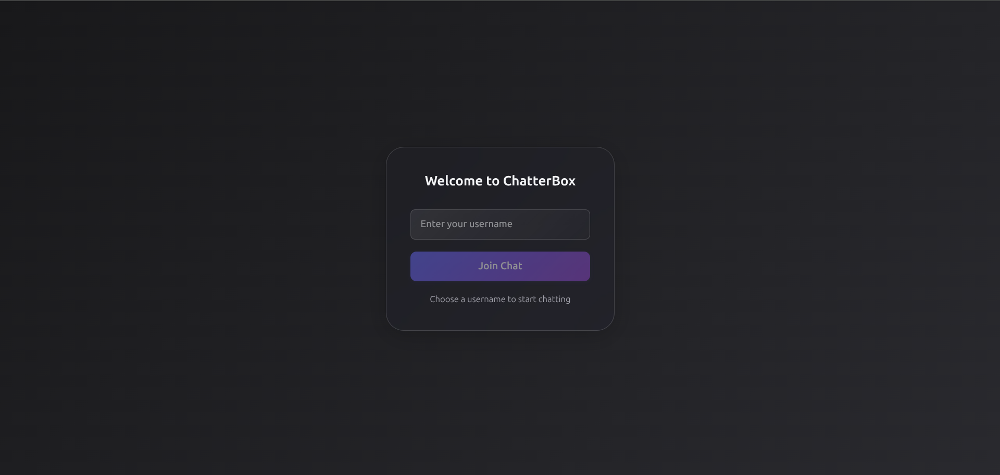
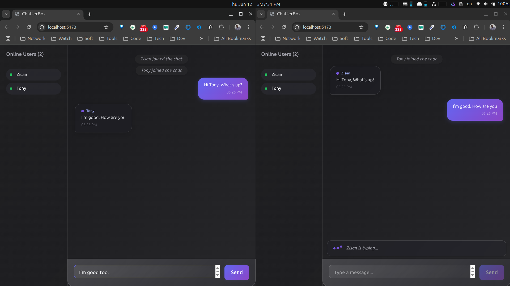

# ChatterBox 💬

A modern, real-time group chat application built with React (Vite), Socket.IO, and Node.js.  
Beautiful glassmorphism UI, responsive for all screens, and robust event-driven backend.  
**Created and maintained by [@ZisanSarker](https://github.com/ZisanSarker)**

---

## ✨ Features

- **Real-time Group Chat:** Lightning-fast messaging using Socket.IO.
- **Glassmorphism UI:** Sleek, modern, and visually appealing dark-blur gradients.
- **Responsive Design:** Optimized for desktop, tablet, and mobile.
    - Sidebar for active users on larger screens; topbar on mobile.
    - Shows up to 5 recent online users on mobile.
- **User Presence:** See who's online, who's typing, instant join/leave notifications.
- **System Messages:** Get alerts when users join or leave.
- **Persistent History:** Messages are stored (in-memory by default) and loaded on reconnect.
- **Accessibility:** Keyboard navigation, screen-reader friendly, and accessible color contrast.
- **Secure Backend:** Helmet, CORS, rate limiting, and production-ready Express server.
- **Easy Customization:** Well-structured, modular code for rapid feature development.

---

## 📸 Screenshots




---

## 🚀 Getting Started

### 1. Clone the repository

```bash
git clone git@github.com:ZisanSarker/ChatterBox.git
cd ChatterBox
```

### 2. Install dependencies

#### For Backend
```bash
cd backend
npm install
```

#### For Frontend
```bash
cd ../frontend
npm install
```

### 3. Configure Environment (Optional)

- Set your desired `FRONTEND_URL` and `PORT` in the backend `.env`.
- By default, backend runs on `localhost:5000` and frontend on `localhost:5173`.

### 4. Start the App

#### Start Backend
```bash
cd backend
npm run dev
```

#### Start Frontend
```bash
cd ../frontend
npm run dev
```

Open [http://localhost:5173](http://localhost:5173) and start chatting!

---

## 🗂️ Project Structure

```
backend/
  ├── src/
  │   ├── sockets/
  │   ├── storage/
  │   ├── routes/
  │   ├── middlewares/
  │   └── ...
  └── ...
frontend/
  ├── src/
  │   ├── components/
  │   ├── pages/
  │   ├── context/
  │   ├── hooks/
  │   ├── constants/
  │   └── ...
  └── ...
```

---

## 🛡️ Security & Best Practices

- **Helmet** for HTTP headers.
- **CORS** with origin whitelisting.
- **Rate limiting** on message endpoints.
- **Socket.io events sanitized** and validated.

---

## 🛠️ Customization

- **Theme:** Easily adjust gradients, colors, and glassmorphism in `frontend/src/constants/colors.ts` and `styles.ts`.
- **Message persistence:** Swap out in-memory storage for a database in `backend/src/storage/message.storage.ts`.
- **Deploy:** Ready for deployment on platforms like Vercel, Render, Heroku, or your own VPS.

---

## 🤝 Contributing

Contributions are welcome! Please open an issue or submit a pull request for new features, bug fixes, or improvements.

---

## 📄 License

[MIT](LICENSE)

---

## 👤 Author

- [Zisan Sarker](https://github.com/ZisanSarker)

---

## 🙏 Acknowledgements

- [React](https://react.dev/)
- [Vite](https://vitejs.dev/)
- [Socket.IO](https://socket.io/)
- [Express](https://expressjs.com/)
- [uuid](https://www.npmjs.com/package/uuid)
- And all open-source contributors!

---